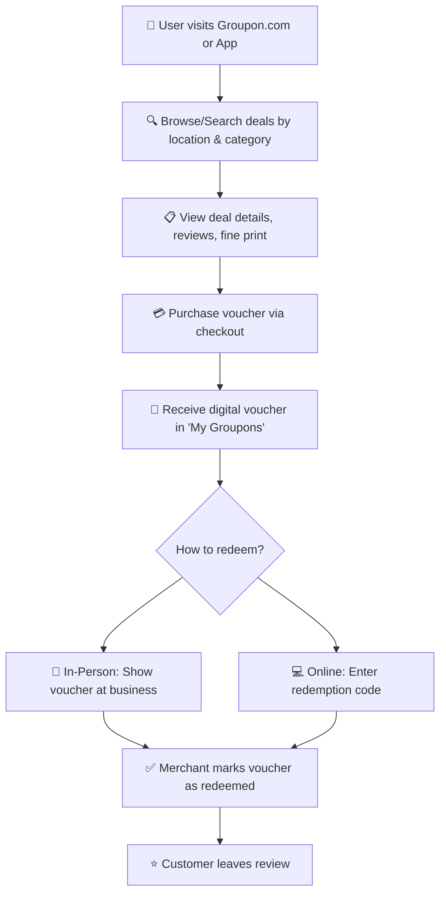
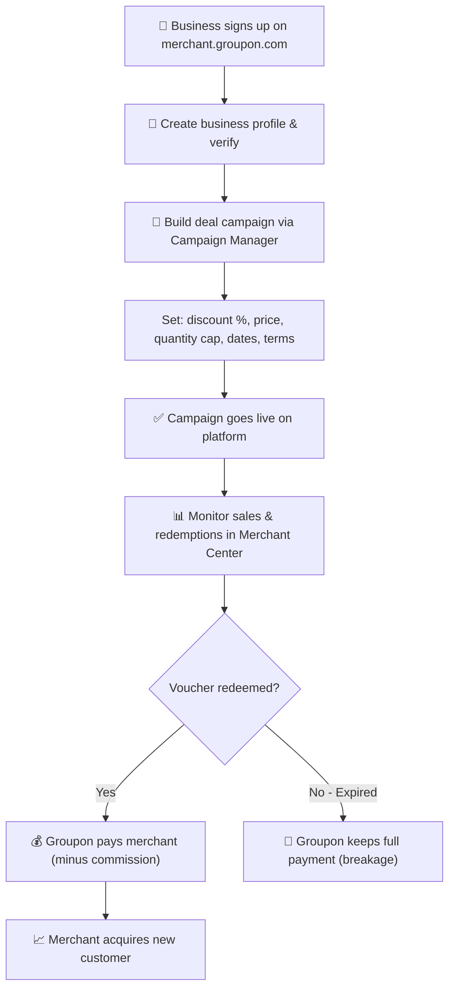
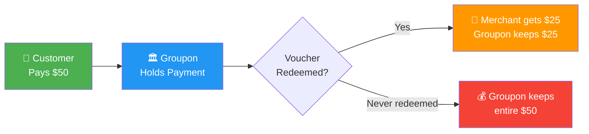
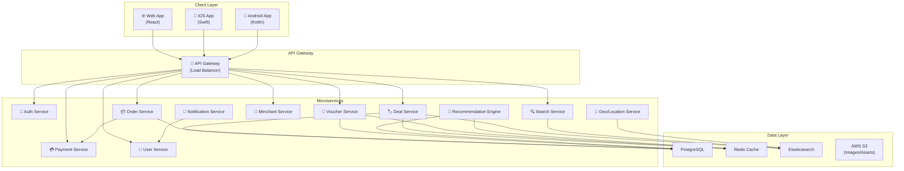
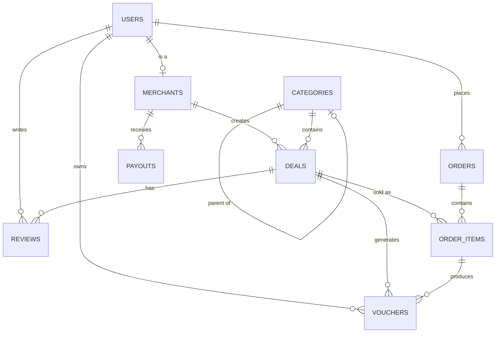
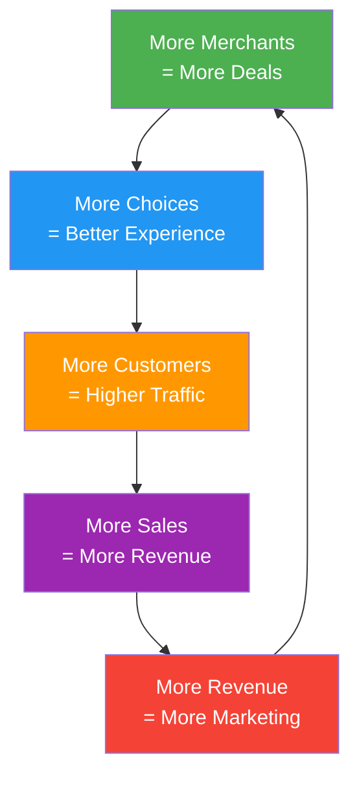

# 🔍 Groupon Deep Analysis — Complete Business Blueprint

> **Goal:** Understand every layer of Groupon.com — how it works, how it makes money, and exactly what you need to build something like it.

---

## 1. What Is Groupon?

Groupon is a **two-sided e-commerce marketplace** that connects:
- **Consumers** looking for discounted local experiences, services, and goods
- **Merchants** (local businesses) wanting to acquire new customers

Think of it as a **digital middleman** — businesses offer steep discounts through Groupon to attract new customers, and Groupon takes a cut of every sale.

### The Core Value Proposition

| For Consumers | For Merchants |
|---|---|
| Save 30-90% on local services, dining, travel, and goods | Acquire new customers at zero upfront cost |
| Discover new local businesses and experiences | Monetize excess capacity during off-peak hours |
| Convenient digital vouchers via app/web | Free marketing & promotion to millions of users |
| Curated, geo-targeted recommendations | Self-service campaign management tools |

---

## 2. 💰 Revenue Streams — How Groupon Makes Money

### Stream 1: Transaction Commissions (PRIMARY — ~80% of revenue)

This is the **bread and butter**. Here's the exact flow:

```
🏪 Merchant offers $100 massage at 50% off → Deal price = $50
👤 Customer buys voucher on Groupon for $50
💰 Groupon keeps ~50% commission → $25
🏪 Merchant receives → $25
```

> [!IMPORTANT]
> The commission split is **negotiable** (not fixed). It ranges from **25% to 50%** depending on the business type, deal depth, and negotiation. The commonly cited industry average is ~40-50%.

**How the math works for a typical deal:**

| Item | Amount |
|---|---|
| Original Service Price | $100 |
| Discount Offered (50% off) | -$50 |
| Customer Pays (Voucher Price) | $50 |
| Groupon Commission (~50% of voucher) | $25 |
| Merchant Receives | $25 |
| **Merchant's effective discount** | **75% off original price** |

---

### Stream 2: Breakage Revenue (HIDDEN GOLDMINE — ~10-15%)

**Breakage** = Revenue from vouchers that are **purchased but never redeemed**.

- Industry data suggests **10-20%** of all Groupon vouchers go unredeemed
- Groupon keeps 100% of this revenue (they already paid nothing for the service)
- This is **pure profit** — no service cost, no merchant payout

> [!TIP]
> This is one of the most profitable streams. When a customer buys a voucher and forgets to use it, Groupon keeps the full purchase price with zero cost of goods sold.

---

### Stream 3: Premium Placement & Advertising (~5-8%)

Merchants pay **extra** for:
- **Featured/Sponsored placement** at top of search results
- **Enhanced listing visibility** on category pages
- **Targeted advertising** to specific customer segments
- **Campaign sponsorship** to boost deal reach

---

### Stream 4: Subscription Revenue (Groupon Select / Groupon+)

- Monthly membership fee ($4.99/month)
- Members get **extra 25% off** already discounted deals
- Drives recurring revenue + locks in customer loyalty
- Creates a premium tier with priority access to deals

---

### Stream 5: Direct Goods Sales (~5-10%)

- Groupon acts as **first-party seller** for physical products
- Electronics, home goods, beauty products, etc.
- Revenue = full sale price minus cost of goods + shipping
- This segment has been **declining** as Groupon refocuses on local

---

### Stream 6: Affiliate/Coupon Revenue

- Groupon's **Coupons section** aggregates promo codes for major brands (Amazon, Nike, Target, etc.)
- Revenue via **affiliate commissions** when users click through and purchase
- No inventory risk — pure referral income

---

## 3. 📊 Financial Performance (2024 Actuals)

| Metric | 2024 | 2023 | Change |
|---|---|---|---|
| **Revenue** | $492.6M | $514.9M | -4% |
| **Gross Billings** | $1.56B | $1.65B | -5% |
| **Gross Profit** | $444.3M | $450.7M | -1% |
| **Gross Margin** | ~90% | ~88% | +2pp |
| **Net Loss** | -$56.5M | -$52.9M | Wider |
| **Adjusted EBITDA** | $69.3M | $55.5M | +25% |
| **Operating Cash Flow** | $55.9M | — | — |
| **Free Cash Flow** | $40.6M | — | — |

> [!NOTE]
> **Key Insight:** Groupon processes **$1.56 BILLION** in transactions but only reports **$493M as revenue** (their commission cut). The ~90% gross margin shows how asset-light this model is — Groupon doesn't produce any service/product themselves.

### Revenue Breakdown by Segment

```
┌─────────────────────────────────────────────┐
│  LOCAL (Services, Dining, Beauty, Events)   │  ~65% of revenue
│  ████████████████████████████████████████    │  HIGH margin
├─────────────────────────────────────────────┤
│  TRAVEL (Hotels, Getaways, Tours)           │  ~15% of revenue 
│  ██████████████                             │  HIGH margin
├─────────────────────────────────────────────┤
│  GOODS (Physical Products)                  │  ~20% of revenue
│  ████████████████████                       │  LOW margin (declining)
└─────────────────────────────────────────────┘
```

---

## 4. 🔄 Complete Process Flow

### Customer Journey



### Merchant Journey



### Money Flow



---

## 5. 🏗️ Technology Architecture

### Groupon's Actual Tech Stack

| Layer | Technology |
|---|---|
| **Backend (primary)** | Java (microservices) |
| **Web Tier** | Node.js |
| **Frontend** | React (web), Swift (iOS), Kotlin (Android) |
| **Infrastructure** | AWS (EKS, Kubernetes) |
| **Databases** | MySQL, PostgreSQL, MongoDB |
| **Caching** | Redis |
| **Search** | Elasticsearch |
| **DevOps** | Kubernetes, Helm, Terraform |
| **Architecture** | Microservices (domain-driven design) |
| **A/B Testing** | Custom experimentation framework |
| **Payments** | Custom payment processing |

### Architecture Overview



---

## 6. 🎯 Marketing & Growth Engine

### Traffic Sources (Estimated Distribution)

| Channel | % of Traffic | Purpose |
|---|---|---|
| **Organic Search (SEO)** | ~35% | "Things to do near me", "spa deals Chicago" |
| **Direct / Brand** | ~25% | Returning users, app opens |
| **Email Marketing** | ~20% | Retention, reactivation, daily deals |
| **Paid Search (SEM)** | ~10% | High-intent acquisition |
| **App Push Notifications** | ~5% | Geo-targeted instant deals |
| **Social / Influencer** | ~3% | Awareness, new audiences |
| **Affiliate** | ~2% | Partner referrals |

### SEO Strategy (Their Secret Weapon)

Groupon dominates local search with a massive page footprint:

```
groupon.com/local/{city} → City landing page
groupon.com/local/{city}/{category} → Category in city
groupon.com/local/{city}/{subcategory} → Subcategory
groupon.com/deals/{deal-slug} → Individual deal page
```

- **800+ city pages** with localized content
- **50+ category pages per city** = 40,000+ indexed pages
- Long-tail keyword domination: "massage near me", "bowling deals Chicago"
- User-generated reviews boost page authority

### Email Marketing Machine

- **150M+ subscriber base**
- Hyper-segmented by: location, purchase history, interests, engagement
- Daily deal emails with personalized recommendations
- Winback campaigns for inactive users
- Cart abandonment flows

---

## 7. 🆚 Competitive Landscape

| Platform | Model | Focus | Threat Level |
|---|---|---|---|
| **Yelp** | Reviews + Deals | Local discovery with deals | 🔴 HIGH |
| **Google Local Services** | Direct booking | Service booking | 🔴 HIGH |
| **LivingSocial** | Daily deals | Local deals (owned by Groupon) | ⚪ N/A |
| **Travelzoo** | Travel deals | Travel & entertainment | 🟡 MEDIUM |
| **RetailMeNot** | Coupon codes | Online retail coupons | 🟢 LOW |
| **Rakuten/Honey** | Cashback | Online shopping rewards | 🟢 LOW |
| **Social Media** | Direct promotions | Business-to-consumer direct | 🔴 HIGH |
| **Square/Shopify** | Loyalty tools | Merchant-owned loyalty | 🟡 MEDIUM |

---

## 8. 🚀 BUILD YOUR OWN: Complete MVP Blueprint

### Project Name: **COUPONUS BD** (Your Deal Marketplace)

### Phase 1: Core Features (MVP — 6-8 weeks)

#### Customer Portal
- [ ] User registration/login (email + social OAuth)
- [ ] Homepage with geo-targeted featured deals
- [ ] Search with filters (category, location, price range, discount %)
- [ ] Deal detail page (images, description, fine print, reviews, map)
- [ ] Shopping cart + checkout (Stripe/SSLCommerz for BD)
- [ ] "My Vouchers" dashboard (active, redeemed, expired)
- [ ] Digital voucher with QR code
- [ ] Review & rating system

#### Merchant Portal
- [ ] Merchant registration + business verification
- [ ] Deal creation wizard (title, description, pricing, quantity caps, dates)
- [ ] Campaign dashboard (views, sales, redemptions, revenue)
- [ ] Voucher redemption scanner (QR code reader)
- [ ] Payout tracking & history
- [ ] Analytics (customer demographics, peak times)

#### Admin Panel
- [ ] Deal moderation & approval workflow
- [ ] User/Merchant management
- [ ] Transaction monitoring
- [ ] Commission configuration
- [ ] Content management (featured deals, banners)
- [ ] Financial reports & payout management

---

### Database Schema

```sql
-- Core Tables

CREATE TABLE users (
    id              UUID PRIMARY KEY DEFAULT gen_random_uuid(),
    email           VARCHAR(255) UNIQUE NOT NULL,
    password_hash   VARCHAR(255) NOT NULL,
    full_name       VARCHAR(255) NOT NULL,
    phone           VARCHAR(20),
    avatar_url      TEXT,
    role            ENUM('customer', 'merchant', 'admin') DEFAULT 'customer',
    is_verified     BOOLEAN DEFAULT FALSE,
    location_lat    DECIMAL(10, 8),
    location_lng    DECIMAL(11, 8),
    created_at      TIMESTAMP DEFAULT NOW(),
    updated_at      TIMESTAMP DEFAULT NOW()
);

CREATE TABLE merchants (
    id              UUID PRIMARY KEY DEFAULT gen_random_uuid(),
    user_id         UUID REFERENCES users(id) ON DELETE CASCADE,
    business_name   VARCHAR(255) NOT NULL,
    business_type   VARCHAR(100),
    description     TEXT,
    logo_url        TEXT,
    cover_image_url TEXT,
    address         TEXT NOT NULL,
    city            VARCHAR(100) NOT NULL,
    area            VARCHAR(100),
    lat             DECIMAL(10, 8),
    lng             DECIMAL(11, 8),
    phone           VARCHAR(20),
    website         VARCHAR(255),
    is_verified     BOOLEAN DEFAULT FALSE,
    commission_rate DECIMAL(5, 2) DEFAULT 40.00,  -- negotiated %
    bank_details    JSONB,
    rating_avg      DECIMAL(3, 2) DEFAULT 0,
    rating_count    INTEGER DEFAULT 0,
    status          ENUM('pending', 'active', 'suspended') DEFAULT 'pending',
    created_at      TIMESTAMP DEFAULT NOW()
);

CREATE TABLE categories (
    id              UUID PRIMARY KEY DEFAULT gen_random_uuid(),
    name            VARCHAR(100) NOT NULL,
    slug            VARCHAR(100) UNIQUE NOT NULL,
    icon            VARCHAR(50),
    parent_id       UUID REFERENCES categories(id),
    sort_order      INTEGER DEFAULT 0
);

CREATE TABLE deals (
    id              UUID PRIMARY KEY DEFAULT gen_random_uuid(),
    merchant_id     UUID REFERENCES merchants(id) ON DELETE CASCADE,
    category_id     UUID REFERENCES categories(id),
    title           VARCHAR(255) NOT NULL,
    slug            VARCHAR(255) UNIQUE NOT NULL,
    description     TEXT NOT NULL,
    fine_print      TEXT,                          -- terms & conditions
    highlights      TEXT[],                        -- bullet point features
    images          TEXT[],                        -- array of image URLs
    original_price  DECIMAL(10, 2) NOT NULL,
    deal_price      DECIMAL(10, 2) NOT NULL,
    discount_pct    DECIMAL(5, 2) GENERATED ALWAYS AS 
                    (ROUND((1 - deal_price / original_price) * 100, 2)) STORED,
    quantity_total  INTEGER NOT NULL,              -- max vouchers available
    quantity_sold   INTEGER DEFAULT 0,
    min_purchase    INTEGER DEFAULT 1,             -- minimum to activate deal
    max_per_user    INTEGER DEFAULT 1,
    start_date      TIMESTAMP NOT NULL,
    end_date        TIMESTAMP NOT NULL,
    redemption_type ENUM('in_store', 'online', 'both') DEFAULT 'in_store',
    status          ENUM('draft', 'pending', 'active', 'paused', 'expired', 'sold_out') DEFAULT 'draft',
    is_featured     BOOLEAN DEFAULT FALSE,
    view_count      INTEGER DEFAULT 0,
    rating_avg      DECIMAL(3, 2) DEFAULT 0,
    rating_count    INTEGER DEFAULT 0,
    created_at      TIMESTAMP DEFAULT NOW(),
    updated_at      TIMESTAMP DEFAULT NOW()
);

CREATE TABLE orders (
    id              UUID PRIMARY KEY DEFAULT gen_random_uuid(),
    user_id         UUID REFERENCES users(id),
    total_amount    DECIMAL(10, 2) NOT NULL,
    commission_amt  DECIMAL(10, 2) NOT NULL,       -- platform's cut
    merchant_amt    DECIMAL(10, 2) NOT NULL,       -- merchant's cut
    payment_method  VARCHAR(50),
    payment_status  ENUM('pending', 'paid', 'failed', 'refunded') DEFAULT 'pending',
    transaction_id  VARCHAR(255),                  -- payment gateway ref
    created_at      TIMESTAMP DEFAULT NOW()
);

CREATE TABLE order_items (
    id              UUID PRIMARY KEY DEFAULT gen_random_uuid(),
    order_id        UUID REFERENCES orders(id) ON DELETE CASCADE,
    deal_id         UUID REFERENCES deals(id),
    quantity        INTEGER NOT NULL,
    unit_price      DECIMAL(10, 2) NOT NULL,
    subtotal        DECIMAL(10, 2) NOT NULL
);

CREATE TABLE vouchers (
    id              UUID PRIMARY KEY DEFAULT gen_random_uuid(),
    order_item_id   UUID REFERENCES order_items(id),
    deal_id         UUID REFERENCES deals(id),
    user_id         UUID REFERENCES users(id),
    voucher_code    VARCHAR(20) UNIQUE NOT NULL,    -- unique alphanumeric
    qr_data         TEXT,                           -- QR code data
    status          ENUM('active', 'redeemed', 'expired', 'refunded') DEFAULT 'active',
    redeemed_at     TIMESTAMP,
    redeemed_by     UUID REFERENCES users(id),      -- merchant user who scanned
    expiry_date     TIMESTAMP NOT NULL,
    created_at      TIMESTAMP DEFAULT NOW()
);

CREATE TABLE reviews (
    id              UUID PRIMARY KEY DEFAULT gen_random_uuid(),
    user_id         UUID REFERENCES users(id),
    deal_id         UUID REFERENCES deals(id),
    voucher_id      UUID REFERENCES vouchers(id),   -- can only review after purchase
    rating          INTEGER CHECK (rating >= 1 AND rating <= 5),
    comment         TEXT,
    is_verified     BOOLEAN DEFAULT TRUE,           -- verified purchase
    created_at      TIMESTAMP DEFAULT NOW()
);

CREATE TABLE payouts (
    id              UUID PRIMARY KEY DEFAULT gen_random_uuid(),
    merchant_id     UUID REFERENCES merchants(id),
    amount          DECIMAL(10, 2) NOT NULL,
    period_start    DATE NOT NULL,
    period_end      DATE NOT NULL,
    status          ENUM('pending', 'processing', 'paid', 'failed') DEFAULT 'pending',
    paid_at         TIMESTAMP,
    reference       VARCHAR(255),
    created_at      TIMESTAMP DEFAULT NOW()
);

-- Indexes for performance
CREATE INDEX idx_deals_category ON deals(category_id);
CREATE INDEX idx_deals_merchant ON deals(merchant_id);
CREATE INDEX idx_deals_status ON deals(status);
CREATE INDEX idx_deals_location ON merchants(city, area);
CREATE INDEX idx_vouchers_user ON vouchers(user_id);
CREATE INDEX idx_vouchers_status ON vouchers(status);
CREATE INDEX idx_orders_user ON orders(user_id);
```

### Entity Relationship Diagram



---

### Recommended Tech Stack for Your Build

| Layer | Recommended | Why |
|---|---|---|
| **Frontend** | Next.js 14 (React) | SSR for SEO, App Router, great DX |
| **Mobile** | React Native / Flutter | Cross-platform from one codebase |
| **Backend** | Node.js + Express.js | JavaScript full-stack, fast prototyping |
| **Database** | PostgreSQL | ACID compliant, JSONB support, free |
| **Cache** | Redis | Blazing fast for deal feeds & sessions |
| **Search** | Elasticsearch or Meilisearch | Full-text search + geo queries |
| **Payments** | Stripe Connect (int'l) / SSLCommerz (BD) | Marketplace-native split payments |
| **File Storage** | AWS S3 / Cloudflare R2 | Cheap, scalable image hosting |
| **Authentication** | NextAuth.js / Clerk | OAuth + email, role-based access |
| **Hosting** | Vercel (frontend) + Railway/AWS (backend) | Auto-scaling, minimal DevOps |
| **Email** | SendGrid / Resend | Transactional + marketing emails |
| **Maps** | Google Maps API / Mapbox | Location search, deal mapping |
| **QR Codes** | qrcode.js / react-qr-code | Voucher generation |

---

## 9. 💵 Monetization Strategy for YOUR Platform

### Revenue Model Options

| Revenue Stream | How It Works | Expected % of Revenue |
|---|---|---|
| **Commission per sale** | Take 20-40% of each deal sold | 60-70% |
| **Breakage** | Keep revenue from unredeemed vouchers | 10-15% |
| **Featured listings** | Merchants pay for top visibility | 10-15% |
| **Subscription** | Premium membership for customers | 5-10% |
| **Affiliate income** | Coupon code referrals to brands | 3-5% |

### Pricing Strategy

> [!TIP]
> **Start with lower commissions (20-25%)** to attract early merchants. Groupon can charge 40-50% because of their massive user base. You'll need to earn that leverage.

### Sample Unit Economics

```
Average deal price:               ৳500  ($5 USD equivalent)
Your commission (25%):            ৳125
Average orders per day (Year 1):  50
Daily revenue:                    ৳6,250
Monthly revenue:                  ৳187,500  (~$1,700 USD)

Scale target (Year 2):            500 orders/day
Monthly revenue:                  ৳1,875,000  (~$17,000 USD)
```

---

## 10. 📈 Growth Playbook

### Phase 1: Chicken-and-Egg Problem (Month 1-3)

> [!WARNING]
> The **#1 challenge** of any marketplace is the "empty room" problem — no merchants without customers, no customers without merchants.

**Solution — Supply First:**
1. Manually onboard **20-30 merchants** in ONE city/area
2. Offer **0% commission for first 3 months** as incentive
3. Create their deal listings FOR them (concierge onboarding)
4. Focus on **high-frequency categories**: Restaurants, Beauty, Fitness

### Phase 2: Demand Generation (Month 2-4)

1. **Facebook/Instagram Ads** targeting deal-seekers in your city
2. **Local influencer partnerships** (food bloggers, lifestyle accounts)
3. **WhatsApp/Telegram groups** for daily deal alerts (huge in BD)
4. **SEO content** — Blog posts like "Best Spa Deals in Dhaka"
5. **Referral program** — Both referrer and referee get ৳50 credit

### Phase 3: Scale & Optimize (Month 4-12)

1. Expand to **2-3 more cities**
2. Launch **mobile app** (push notifications = 3x engagement)
3. Introduce **premium placement** revenue stream
4. Build **email marketing automation**
5. Add **AI-powered recommendations** based on purchase history

### Phase 4: Flywheel Effect (Year 2+)



---

## 11. 💰 Estimated Build Cost

| Item | DIY (You + AI) | Agency | Freelancer |
|---|---|---|---|
| **MVP (8-12 weeks)** | $0 (your time) | $15k-40k | $5k-15k |
| **Hosting (monthly)** | $20-50 | $100-300 | $50-100 |
| **Domain + SSL** | $15/year | $15/year | $15/year |
| **Payment Gateway** | 2-3% per txn | 2-3% per txn | 2-3% per txn |
| **Email Service** | Free tier → $20/mo | $50-200/mo | $20-50/mo |
| **Maps API** | Free tier → $50/mo | Included | $50/mo |

> [!TIP]
> Since you're a developer (I can see your PTE Verse project), you can build the MVP yourself. I can help you build the entire platform — just say the word. 🚀

---

## 12. 🎯 Key Success Metrics to Track

| Metric | What It Measures | Target (Year 1) |
|---|---|---|
| **GMV (Gross Merchandise Value)** | Total transaction volume | $50k/month |
| **Take Rate** | Commission as % of GMV | 25-30% |
| **Active Merchants** | Merchants with live deals | 100+ |
| **Monthly Active Users** | Unique visitors/buyers | 10,000+ |
| **Conversion Rate** | Visitors → Buyers | 3-5% |
| **Voucher Redemption Rate** | % of purchased vouchers used | 80-85% |
| **Merchant Retention** | Merchants running repeat campaigns | 60%+ |
| **Customer Repeat Rate** | Customers buying 2+ times | 30%+ |
| **CAC (Customer Acquisition Cost)** | Cost per new customer | <$2 |
| **LTV (Lifetime Value)** | Revenue per customer over time | >$10 |

---

## 13. ⚠️ Risks & Challenges

| Risk | Mitigation |
|---|---|
| Merchants undercut you (direct deals after acquisition) | Build loyalty programs, track repeat purchases |
| Quality control issues | Implement review system + merchant verification |
| High refund rates | Strong fine print/terms, merchant vetting |
| Payment fraud | Use established payment gateways, KYC |
| Customer trust (new platform) | Show verified reviews, money-back guarantee |
| Chicken-and-egg supply problem | Concierge onboarding, free initial period |

---

## Summary: Groupon in One Sentence

> **Groupon is a commission-based marketplace that profits from the spread between what customers pay for discounted deals and what merchants receive, with bonus income from unredeemed vouchers, premium placements, and subscriptions.**

The model is **asset-light** (no inventory), **high-margin** (90% gross margin), and **infinitely scalable** with network effects. The hardest part isn't the tech — it's solving the cold-start problem of getting your first merchants and customers onto the platform simultaneously.

---

*Ready to build? Your workspace `COUPONUS BD` is waiting. Let's make it happen! 🔥*
