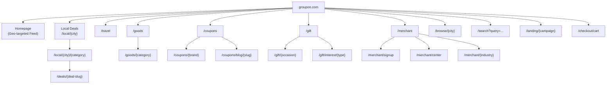

# 🔬 Groupon.com — Full Site Analysis (Multi-Skill Audit)

> **Date:** April 17, 2026  
> **Skills Applied:** Senior Frontend, Senior Backend, UX Researcher, UI Design System, Product Strategist, Landing Page Generator, SEO Auditor, Competitive Teardown  
> **Goal:** Reverse-engineer every layer of Groupon.com to inform COUPONUS BD development

---

## 📐 1. Information Architecture & Site Map



### URL Pattern Analysis (🔍 SEO Skill)

| Page Type | URL Pattern | SEO Purpose |
|-----------|-------------|-------------|
| City hub | `/local/{city}` | Rank for "[city] deals" |
| Category in city | `/local/{city}/{category}` | Rank for "spa deals Chicago" |
| Sub-category | `/local/{city}/{subcategory}` | Long-tail: "deep tissue massage Chicago" |
| Deal page | `/deals/{deal-slug}` | Individual deal indexing |
| Browse page | `/browse/{city}` | Experience-focused search intent |
| Coupons brand | `/coupons/{brand}` | Rank for "Nike coupons" |
| Gift occasion | `/gift/{occasion}` | Rank for "birthday gift ideas" |
| SEO blog | `/coupons/blog/{slug}` | Rank for "Sephora sales calendar 2025" |
| Travel | `/travel/{type}` | "all-inclusive vacation deals" |
| Goods | `/goods/{category}` | Product category pages |

> [!IMPORTANT]
> **Massive SEO footprint:** Groupon has **800+ city pages × 50+ categories = 40,000+ indexed pages** just from the local directory. Their `/coupons/blog/` section acts as a content marketing engine targeting high-volume branded search queries like "Nike sales calendar 2025".

---

## 🧭 2. Navigation & Information Hierarchy

### Global Navigation Structure

```
┌──────────────────────────────────────────────────────────────────┐
│  LOGO  │ Search Bar (📍 Location)  │ 🛒 Cart │ 👤 Sign In      │
├──────────────────────────────────────────────────────────────────┤
│ Beauty & Spas │ Things To Do │ Auto & Home │ Food & Drink │     │
│ Gifts │ Local │ Travel │ Goods │ Coupons                        │
└──────────────────────────────────────────────────────────────────┘
```

### Primary Navigation Tabs (9 items)

| Tab | Sub-categories (Level 2) | Sub-sub (Level 3) |
|-----|--------------------------|---------------------|
| **Beauty & Spas** | Massage, Hair Removal, Face & Skin, Cosmetic, Spas, Hair Styling, Health & Fitness, Weight Loss, Nails, Dental, Brows & Lashes, Tanning | — |
| **Things To Do** | Fun & Leisure, Tickets & Events, Kids Activities, Sightseeing, Sports & Outdoors, Museums, Photography, Amusement Parks, Bowling, Trampoline, Boat Tours, Classes, Escape Games, Arcades | — |
| **Auto & Home** | Oil Change, Auto Repair, Car Wash, Parking, Home Services, Cleaning, Bedding, Furniture, Patio & Garden, Kitchen | — |
| **Food & Drink** | Restaurants, Cafes, Bakeries, Bars, Breweries/Wineries, Groceries, American, Asian, Latin, Pizza, Seafood, Steakhouse | — |
| **Gifts** | By Recipient (Her/Him/Couples/Kids), By Occasion (Birthday/Anniversary/Wedding/Graduation), By Interest (Foodies/Relaxing/Sports/Travel), By Price ($10-$100+), Trending, Personalized, Flowers, Gift Cards | — |
| **Local** | Beauty, Personal Services, Health & Fitness, Retail, Things To Do, Food & Drink, Auto & Home, Home Services, Gift Cards | — |
| **Travel** | Air-Inclusive, Waterparks, Casinos, Family, Romantic, Beach, City, Outdoor, All-Inclusive, Cruises, Culinary, Luxury, Spa & Wellness, Unique Lodging | — |
| **Goods** | Health & Beauty (11 sub), Home (13 sub), Women's Fashion (5 sub), Personalized (10 sub), CBD, Electronics, Jewelry, Men's, Grocery, Auto, Sports, Pets, Baby, Toys | — |
| **Coupons** | Popular Brands (20 shown), Trending (15 shown), Blog Content (15+ articles) | — |

> [!TIP]
> **Key Insight for COUPONUS BD:** Groupon's navigation has **3 levels of depth** with 9 primary tabs exposing 100+ subcategories. For your MVP, focus on **5 primary categories** with 5-8 subcategories each. Expand from there.

---

## 🎨 3. UI Design System Analysis (Design Token Extraction)

### Color Palette

| Token | Hex | Usage |
|-------|-----|-------|
| **Primary Green** | `#0b8043` | CTAs ("Buy Now", "See Deals"), active states |
| **Dark Green** | `#0a5c30` | Button hover state |
| **Discount Red** | `#e02020` | Discount percentage badges ("-79%") |
| **Price Green** | `#0b8043` | Current/sale price display |
| **Strike Gray** | `#999999` | Original price (strikethrough) |
| **Star Gold** | `#f5a623` | Rating stars |
| **Text Primary** | `#2c3e50` or near-black | Headlines, deal titles |
| **Text Secondary** | `#6b7280` | Metadata, distances, merchant name |
| **Background** | `#ffffff` | Page background |
| **Card Background** | `#ffffff` | Deal cards |
| **Card Border** | `#e5e7eb` | Subtle card borders |
| **Light Blue BG** | `#eef4ff` | Selected option highlight |
| **Badge Purple** | `#7c3aed` | "Popular Gift" badge |
| **Badge Green** | `#22c55e` | "Book Online" badge |
| **Link Blue** | `#0066cc` | Text links |

### Typography

| Element | Font | Size | Weight |
|---------|------|------|--------|
| Deal title (card) | System sans-serif | 14-16px | Bold (700) |
| Deal title (detail) | System sans-serif | 24-28px | Bold (700) |
| Price (sale) | System sans-serif | 18-22px | Bold (700) |
| Price (original) | System sans-serif | 14px | Normal + strikethrough |
| Discount badge | System sans-serif | 14px | Bold |
| Rating | System sans-serif | 14px | Semi-bold (600) |
| Body text | System sans-serif | 14-16px | Normal (400) |
| Nav items | System sans-serif | 14px | Medium (500) |

### Spacing & Layout

| Token | Value | Usage |
|-------|-------|-------|
| Card padding | 12-16px | Internal card spacing |
| Card gap | 16-20px | Between deal cards in grid |
| Card border-radius | 8-12px | Rounded corners |
| Section padding | 24-40px vertical | Between page sections |
| Max content width | ~1200px | Container width |
| Image aspect ratio | ~16:10 or 3:2 | Deal card hero images |

### Component Inventory

| Component | Variants Observed |
|-----------|-------------------|
| **Deal Card** | Standard, Sponsored, Popular Gift, Book Online, Great for Groups, Multi-location |
| **Badge** | "Popular Gift" (purple), "Book Online" (green), "Sponsored" (gray), "Great for Groups" (blue), "Limited time" (text) |
| **Price Display** | Original (struck), Intermediate (struck), Current (green/bold), Extra discount (green text) |
| **CTA Button** | "Buy Now" (solid green), "Buy As a Gift" (outline green), "See Deals" (solid green), "Get Started" (solid green) |
| **Rating** | Star icons (gold) + numeric + review count in parentheses |
| **Promo Banner** | Full-width gradient with headline + subtext + link |
| **Category carousel** | Horizontal scrollable image cards with text overlay |

---

## 🛍️ 4. Deal Card Anatomy (Detailed Breakdown)

```
┌─────────────────────────────────────┐
│  [DEAL IMAGE - 3:2 ratio]          │
│  ┌──────────┐                      │
│  │ Popular  │  (badge top-left)    │
│  │   Gift   │                      │
│  └──────────┘                      │
├─────────────────────────────────────┤
│  Merchant Name (gray, 12px)        │
│  Deal Title (bold, 14-16px, 2-3    │
│  lines max, ellipsis overflow)     │
│  📍 Address/Area, City  ·  3.8 mi │
│  ⭐⭐⭐⭐☆ 4.6 (9,254)            │
│                                    │
│  $̶8̶0̶  $49  $44.10               │
│        ↑current   ↑with code       │
│  -45%  Limited time                │
│  (red)  (green text)               │
│                                    │
│  $39.69 (final after extra off)    │
└─────────────────────────────────────┘
```

### Price Display Pattern (Critical UX Pattern)

Groupon uses a **4-tier price anchoring** system:

| Layer | Example | Visual Treatment | Psychology |
|-------|---------|-----------------|------------|
| **1. Original Price** | ~~$80~~ | Gray, strikethrough, small | "The full value" anchor |
| **2. Groupon Price** | $49 | Black, medium | "Already discounted" |
| **3. With Code** | $44.10 | Green, bold | "Even cheaper if you act" |
| **4. Percentage Off** | -45% | Red badge | "Look how much you save" |
| **5. Extra Promo** | "Extra $3 off, ends tomorrow" | Green text | Urgency + stacking |

> [!IMPORTANT]
> **This multi-layer pricing is Groupon's #1 conversion trick.** It creates the illusion of compound savings and urgency. Implement at minimum layers 1, 2, and 4 in your MVP.

---

## 📱 5. Deal Detail Page Analysis

### Layout (from browser screenshots)

```
┌──────────────────────────────────────────────────────┐
│  [Breadcrumb Navigation]                             │
├──────────────────────────────────────────────────────┤
│  ┌─────────────────┐  ┌─────────────────────────┐   │
│  │                 │  │ Deal Title (h1)          │   │
│  │  IMAGE GALLERY  │  │ Merchant Name (linked)   │   │
│  │   (main hero)   │  │ 📍 Address, City         │   │
│  │                 │  │ ⭐ 4.8 (5K+ reviews)     │   │
│  │                 │  │                          │   │
│  │  [thumb][thumb] │  │ ┌──────────────────────┐ │   │
│  │  [thumb][thumb] │  │ │ Select Option:       │ │   │
│  │                 │  │ │ ○ 45-min Tour - $28  │ │   │
│  └─────────────────┘  │ │   5,000+ bought      │ │   │
│                       │ │ ○ 90-min Tour - $45  │ │   │
│                       │ │   1,000+ bought      │ │   │
│                       │ │ ○ Sunset Tour - $45  │ │   │
│                       │ │   380+ bought        │ │   │
│                       │ └──────────────────────┘ │   │
│                       │                          │   │
│                       │  [- 1 +]  quantity       │   │
│                       │                          │   │
│                       │  ┌────────┐ ┌──────────┐ │   │
│                       │  │Buy As  │ │ Buy Now  │ │   │
│                       │  │A Gift  │ │ (green)  │ │   │
│                       │  └────────┘ └──────────┘ │   │
│                       └─────────────────────────┘│   │
├──────────────────────────────────────────────────────┤
│  Review Section: "Rebecca - 4 days ago - ⭐⭐⭐⭐⭐"  │
│  "One of the best deals."                            │
│  [Show all reviews]                                  │
├──────────────────────────────────────────────────────┤
│  Description / Highlights / Fine Print (tabs)        │
├──────────────────────────────────────────────────────┤
│  📍 Map embed with merchant location                 │
├──────────────────────────────────────────────────────┤
│  Related Deals carousel                              │
└──────────────────────────────────────────────────────┘
```

### Key UX Patterns on Deal Detail

| Pattern | Implementation | Purpose |
|---------|---------------|---------|
| **Radio option selector** | Radio buttons for deal variants with price + "X bought" | Social proof per option |
| **"X+ bought" counter** | Displayed per variant: "5,000+ bought", "100,000+ bought" | Massive social proof |
| **Dual CTA** | "Buy As a Gift" (outline) + "Buy Now" (solid green) | Gift use case = 2nd revenue stream |
| **Sticky mobile CTA** | Price + "See Deals" button fixed at bottom on mobile | Never lose the conversion moment |
| **"Limited time"** | Green text next to extra discount price | Urgency creation |
| **Review inline** | Recent review shown directly on purchase card | Trust right at decision point |
| **Multi-location badge** | "(191 Locations)" next to merchant name | Scale / accessibility signal |

---

## 🏢 6. Merchant Portal Analysis (Product Strategist Skill)

### Merchant Landing Page Structure

```
Hero: "Groupon helps local businesses reach nearby customers who are ready to buy"
      "From solo entrepreneurs to multi-location venues. We help you grow—fast."

Section 1: TESTIMONIALS (rotating carousel with 3 slides)
  - "65,000+ customers" 
  - "40% increase in business"
  - "180+ Groupons sold in just 3 months"

Section 2: STATS (social proof numbers)
  - 70% new customer reach
  - +38% increase in follow-on spend  
  - 75% intend to come back
  - +45% increase in bookings

Section 3: HOW IT WORKS (3 steps)
  1. Create your account → verify email, business profile
  2. Build your offer → service details, pricing
  3. Verify your business → publish and go live

Section 4: INSIGHTS DASHBOARD (screenshot)
  - "Clear, simple analytics that show how your offer is performing"

Section 5: BOOKING SOLUTIONS
  - Mindbody, Square, Booker integrations
  - "Let Customers Book Anytime. Automatically."

Section 6: INDUSTRY SOLUTIONS
  - Health Beauty & Spa | Food & Drink | Activities | Travel | Hotels | Home & Auto

Section 7: FAQ (expandable)
  - "No upfront costs" messaging
  - Commission-based model explanation
  - Tool descriptions (Merchant Center, Campaign Manager, Ads, Booking)

CTA: "Join Over 1 Million Merchants Who've Grown Their Business With Groupon"
     "Get started in minutes — no upfront cost."
     [Start Selling Now] button
```

### Merchant Tools Ecosystem

| Tool | Purpose |
|------|---------|
| **Merchant Center** | Main portal — campaign management, voucher redemption, performance data, demographics |
| **Campaign Manager** | Self-service deal builder — title, pricing, quantity, dates, terms |
| **Ads for Campaigns** | Paid boost to top of search results (premium placement revenue) |
| **Booking Solutions** | API integrations with Mindbody, Square, Booker for 24/7 booking |
| **Partner Program** | Third-party integrations ecosystem |
| **Performance Dashboard** | Analytics — views, sales, redemptions, revenue |

### Merchant Navigation

| Section | Pages |
|---------|-------|
| **By Industry** | Beauty & Wellness, Things to Do, Food & Drink, Getaway, Home & Auto |
| **Tools** | Merchant Center, Booking Solutions, Ads for Campaigns, Groupon Promotions, Partner Program |
| **Resources** | Success Stories, Starting Your Business, Growth Strategies, Business Management, Trends & Insights, FAQ & Help |

> [!TIP]
> **For COUPONUS BD Merchant Portal:** Start with a simplified 3-tool setup: (1) Campaign Manager, (2) Voucher Scanner, (3) Analytics Dashboard. Add booking integrations in Phase 2.

---

## 🏷️ 7. Coupons/Affiliate Section Analysis

### Architecture

```
/coupons                     → Main hub with featured codes
/coupons/{brand}             → Brand-specific page (Amazon, Nike, etc.)
/coupons/categories          → Category index
/coupons/categories/{cat}    → Category page (Travel, Women's Clothing, etc.)
/coupons/seasonal/{event}    → Seasonal pages (Black Friday, Mother's Day)
/coupons/exclusives          → Groupon-exclusive codes
/coupons/all-brands          → A-Z brand directory
/coupons/blog/{slug}         → Content marketing articles
/coupons/groupon-genie       → Browser extension
```

### Key Features

| Feature | Implementation |
|---------|---------------|
| **Brand logos strip** | Horizontal scrollable logos: Amazon, Avis, Booking, Budget, Costco, Disney+, etc. |
| **Code reveal** | "See Code" button reveals masked code (e.g., "xhg") |
| **Deal links** | "Get Deal" / "View Sale" redirect to merchant site |
| **Category tabs** | Travel, Women's, Men's, Home, Health & Beauty |
| **Blog content** | "Sephora Sales Calendar 2025", "Nike Clearance Stores" — SEO content plays |
| **Genie extension** | Browser extension for auto-applying codes |
| **Affiliate disclosure** | "Groupon may earn a commission when you buy through links" |

> [!NOTE]
> **Revenue model:** This entire section is **pure affiliate income**. Groupon earns commission when users click through and purchase from partner retailers. Zero inventory risk.

---

## 🛒 8. Checkout Flow Analysis

### Observed Flow

```
Deal Page → Select Option (radio) → Set Quantity → "Buy Now" 
→ Cart Page → Sign In Gate → Payment → Confirmation
```

### Cart Page Components

| Element | Detail |
|---------|--------|
| **Option display** | Full option name repeated with prices |
| **Multi-tier pricing** | ~~$240~~ ~~$64.99~~ **$58.49** -76% + "Extra $6.50 off, ends tomorrow" |
| **Quantity** | [- 1 +] stepper control |
| **Social proof** | "25,000+ bought" per option |
| **Dual CTA** | "Buy As a Gift" (outline) + "Buy Now" (solid green) |
| **Review snippet** | Recent review shown inline on cart page |
| **Selected highlight** | Selected option has light blue background border |

### Price Stacking Display

```
Original:     $240  (gray, strikethrough)
Previous:     $64.99 (gray, strikethrough) 
Current:      $58.49 (green, bold, large)
Discount:     -76% (red badge)
Extra:        Extra $6.50 off, ends tomorrow (green text)
Final:        $52.49 implied (not always shown)
```

---

## 📊 9. Homepage Content Strategy Analysis

### Section Order (Top to Bottom)

| # | Section | Purpose |
|---|---------|---------|
| 1 | **Promo banner** | "Up to 75% off with code TOPDEALS" — urgency + promo code |
| 2 | **Category navigation** | 9-tab mega menu with deep subcategories |
| 3 | **Featured deals carousel** | 6-8 geo-targeted deals (Popular Gift, Book Online badges) |
| 4 | **Campaign banners** | 5-6 marketing banners: "Spring Glow-Up", "Fun Never Ends", "Summer Destinations", "Gift Today" |
| 5 | **Sponsored deals** | 8-10 paid placement deals (marked "Sponsored") |
| 6 | **Trending gifts** | Gift-focused carousel for gifting intent |
| 7 | **Best deals grid** | 20+ deals in a dense grid — mix of local, goods, travel |
| 8 | **"Near You" link farm** | 60+ hyperlinks: "Deep Tissue Massage Near You", "Couples Massage Near You" — SEO play |
| 9 | **City pages link farm** | 30+ cities: "Things to Do in Chicago", "Things to Do in NYC" — SEO play |
| 10 | **City index** | Direct links to all 30+ city hubs |
| 11 | **Coupon brand links** | 30+ brand coupon links — SEO + affiliate play |
| 12 | **App download CTA** | "Unlock up to 90% discounts on the go" |
| 13 | **Footer** | Customer Support, Merchant links, Company info, Legal |

> [!IMPORTANT]
> **Critical SEO finding:** The bottom 40% of Groupon's homepage is essentially a **link directory** — hundreds of internal links targeting long-tail local keywords. This is their primary organic traffic engine. Sections 8-11 alone contain **100+ internal links** designed purely for search engine crawling.

---

## 🔍 10. SEO Audit (SEO Auditor Skill)

### Title Tags

| Page | Title | Length | Grade |
|------|-------|--------|-------|
| Homepage | "Groupon® Official Site - Find Local Deals Near You" | 51 chars | ✅ Perfect |
| Chicago browse | "Best Chicago Experiences \| Local Tickets and Activity Bundles" | 62 chars | ✅ Good |
| Coupons | "Coupons & Promo Codes for April 2026 - Groupon" | 48 chars | ✅ Good |
| Merchant | "Groupon Merchant: Grow Your Business with Local Deals" | 54 chars | ✅ Good |

### On-Page SEO Patterns

| Signal | Implementation | Score |
|--------|---------------|-------|
| **H1 usage** | One per page, keyword-rich | ✅ |
| **Meta descriptions** | Present, compelling, action-oriented | ✅ |
| **Breadcrumbs** | Present on deal/category pages | ✅ |
| **Structured data** | FAQPage on merchant, Product schema on deals | ✅ |
| **Internal linking** | Massive — 100+ links per page footer | ✅✅✅ |
| **Canonical URLs** | Set properly | ✅ |
| **URL structure** | Clean, keyword-rich slugs | ✅ |
| **Image alt text** | Present on key images | ⚠️ Mixed |
| **Page speed** | Heavy JS bundle, but CDN-served | ⚠️ |
| **Mobile-first** | Responsive design | ✅ |

### SEO Content Strategy

```
                    ┌─────────────────┐
                    │   Brand Pages   │ ← "Nike coupons"
                    │ /coupons/{brand}│    Affiliate revenue
                    └────────┬────────┘
                             │
    ┌────────────────────────┼────────────────────────┐
    │                        │                        │
┌───┴────┐           ┌──────┴──────┐          ┌──────┴──────┐
│ City   │           │  Category   │          │ Blog SEO    │
│ Pages  │           │  Pages      │          │ Content     │
│/local/ │           │/local/city/ │          │/coupons/    │
│{city}  │           │{category}   │          │blog/{slug}  │
└────────┘           └─────────────┘          └─────────────┘
 "deals in          "spa deals            "Sephora sales
  Chicago"           Chicago"              calendar 2025"
```

---

## 🧪 11. UX Research Findings (UX Researcher Skill)

### User Journey Mapping

| Stage | Action | Touchpoint | Emotion | Pain Point |
|-------|--------|------------|---------|------------|
| **Awareness** | Google "massage deals near me" | Search results → city page | Curious | Too many results, hard to choose |
| **Discovery** | Browse deals, filter by category | Homepage / Category page | Interested | No map view on homepage, scroll-heavy |
| **Evaluation** | Read deal details, reviews, fine print | Deal detail page | Cautious | Fine print can be confusing, terms buried |
| **Purchase** | Select option, add to cart | Cart / checkout | Anxious | Forced sign-in wall before payment |
| **Redemption** | Show voucher at merchant | App / email voucher | Hopeful | Sometimes unclear how to redeem |
| **Review** | Rate experience post-visit | Review form | Satisfied/Dissatisfied | No strong incentive to review |

### Persona Archetypes (Derived)

| Persona | Profile | Goals | Frustrations |
|---------|---------|-------|--------------|
| **Deal Hunter Diana** | 28, Urban, Mobile-first | Find biggest discounts, try new experiences | Information overload, hard to compare |
| **Gift Giver Greg** | 35, Suburban, Desktop | Find unique experience gifts quickly | Can't preview voucher appearance, limited filters |
| **Local Explorer Layla** | 24, City dweller, Social media | Discover new restaurants/activities | Deals feel "cheap", want quality assurance |
| **Busy Parent Pat** | 40, Family-focused, App user | Find kids activities, family deals | Hard to filter for family-friendly, age-appropriate |

### Usability Issues Found

| Severity | Issue | Impact |
|----------|-------|--------|
| 🔴 Major | Sign-in wall before checkout (no guest checkout) | Cart abandonment |
| 🟡 Minor | No "Save for Later" on deal cards (only wishlist via account) | Lost interest conversion |
| 🟡 Minor | Fine print buried in expandable accordion section | Surprise terms post-purchase |
| 🟢 Cosmetic | Inconsistent badge colors across deal types | Brand coherence |
| 🟡 Minor | No "Compare Deals" functionality | Decision paralysis |
| 🔴 Major | Heavy homepage (estimate 3-5MB+ initial load) | Mobile users on slow connections |

---

## ⚙️ 12. Frontend Engineering Analysis (Senior Frontend Skill)

### Tech Stack Observations

| Layer | Evidence |
|-------|----------|
| **Framework** | React (client-rendered with SSR for SEO pages) |
| **State Management** | Redux-like patterns (complex state for cart/auth) |
| **CSS** | Mix of CSS modules and utility classes |
| **Images** | CDN-served, WebP with fallbacks, lazy-loaded |
| **JS Bundle** | Large — estimated 500KB+ compressed |
| **Rendering** | Hybrid SSR (category/deal pages for SEO) + CSR (interactive) |
| **A/B Testing** | Custom experimentation framework visible in code |

### Component Architecture

```
App
├── Layout
│   ├── GlobalHeader (search, nav, cart, auth)
│   ├── PromoBanner (dismissible, promo code)
│   ├── MegaMenu (9 tabs, 3 levels)
│   └── Footer (4 columns, link farms)
├── HomePage
│   ├── FeaturedCarousel (hero deals)
│   ├── CampaignBannerGrid (marketing)
│   ├── DealGrid (infinite scroll / paginated)
│   ├── SponsoredSection (ad deals)
│   ├── NearYouLinks (SEO links)
│   └── AppDownloadCTA
├── DealCard (reusable)
│   ├── DealImage + Badge overlay
│   ├── MerchantInfo
│   ├── PriceDisplay (4-tier)
│   ├── RatingStars
│   └── LocationDistance
├── DealDetail
│   ├── ImageGallery
│   ├── OptionSelector (radio group)
│   ├── QuantityControl
│   ├── DualCTAButtons
│   ├── ReviewSnippet
│   ├── DescriptionTabs
│   ├── MapEmbed
│   └── RelatedDeals
└── Checkout
    ├── CartSummary
    ├── AuthGate
    ├── PaymentForm
    └── OrderConfirmation
```

### Performance Observations

| Metric | Estimated | Target | Gap |
|--------|-----------|--------|-----|
| LCP | ~2.5s | <1.5s | ⚠️ Slow hero image |
| CLS | ~0.15 | <0.1 | ⚠️ Ad slot shifts |
| FID/INP | ~150ms | <100ms | ⚠️ Heavy JS |
| Bundle size | ~500KB+ | <200KB | ❌ Very heavy |

> [!WARNING]
> **For COUPONUS BD:** Don't copy Groupon's heavy bundle. Use Next.js with:
> - Server Components for deal cards
> - Streaming with Suspense for reviews
> - Image optimization with `next/image`
> - Edge runtime for geo-targeted content

---

## 🏗️ 13. Backend Architecture Patterns (Senior Backend Skill)

### API Design Patterns Observed

| Endpoint Pattern | Method | Auth | Purpose |
|-----------------|--------|------|---------|
| `/api/deals?lat=X&lng=Y&cat=Z` | GET | No | Geo-filtered deal feed |
| `/api/deals/{slug}` | GET | No | Deal detail |
| `/api/deals/{id}/reviews` | GET | No | Paginated reviews |
| `/api/search?q=X&location=Y` | GET | No | Full-text search |
| `/api/cart` | POST/PUT | Yes | Cart management |
| `/api/checkout` | POST | Yes | Payment processing |
| `/api/vouchers` | GET | Yes | User's vouchers |
| `/api/merchant/deals` | GET/POST | Yes (merchant) | CRUD deals |
| `/api/merchant/analytics` | GET | Yes (merchant) | Dashboard data |

### Database Schema Insights (from observed data)

```
Key relationships observed:
- Deals have MULTIPLE options (variants) with independent pricing
- Each option tracks its own "bought" count (social proof per variant)
- Deals support multiple redemption locations
- Vouchers have unique codes with QR data
- Reviews are tied to verified purchases
- Merchants can have multiple locations (e.g., "191 Locations")
- Deals support "Sponsored" flag for paid placement
- Price has 4+ layers: original, list, deal, promo
```

### API Patterns to Replicate

| Pattern | How Groupon Does It | Recommendation for COUPONUS BD |
|---------|--------------------|---------------------------------|
| Geo-targeting | IP geolocation → nearest city → geo-filtered feed | Use browser Geolocation API + fallback to IP |
| Social proof counters | "25,000+ bought" — real-time but approximated | Cache and round to nearest 100 |
| Price layering | 4-tier price from API (original, list, deal, promo) | Store original + deal price, calculate discount % |
| Multi-location | Deals linked to multiple merchant locations | Use a `deal_locations` junction table |
| Search | Elasticsearch with geo-queries and category facets | Start with PostgreSQL full-text, upgrade to Meilisearch |

---

## 📈 14. Product Strategy Takeaways (Product Strategist Skill)

### Growth Strategy: What Groupon Does Right

| Strategy | Execution | Impact |
|----------|-----------|--------|
| **SEO moat** | 40,000+ indexed pages across city × category combinations | 35% organic traffic |
| **Social proof** | "100,000+ bought" displayed prominently | Converts hesitant buyers |
| **Price psychology** | 4-tier price anchoring creates perception of massive savings | Higher perceived value |
| **Gift economy** | Dedicated gift section with occasion/recipient targeting | 2nd purchase occasion |
| **Affiliate revenue** | Coupons section generates commission with zero COGS | Pure profit margin |
| **Merchant self-service** | Campaign Manager = zero sales team needed for onboarding | Scalable supply-side |
| **Urgency tactics** | "Limited time", "ends tomorrow", countdown timers | Reduces deliberation time |
| **Promo code stacking** | Global promo code (TOPDEALS) + deal discount + extra off | Maximum perceived savings |

### Key Metrics Groupon Optimizes For

| Metric | Visible Proxy |
|--------|---------------|
| **Conversion rate** | 4-layer price anchoring, urgency text, "X bought" counters |
| **AOV (Average Order Value)** | Multi-option deals, "Buy As a Gift" dual CTA, quantity selector |
| **Repeat purchase** | Email marketing, push notifications, personalized recommendations |
| **Merchant retention** | Self-service tools, analytics dashboard, "0% upfront cost" messaging |
| **SEO traffic** | Massive internal linking, city pages, blog content, structured data |

---

## 🎯 15. Action Items for COUPONUS BD

### Must-Have (Copy from Groupon)

- [ ] **4-tier price display** — original, deal, with-code, percentage off
- [ ] **"X+ bought" social proof counters** on every deal card
- [ ] **Multi-option deal variants** with radio selector
- [ ] **"Buy As a Gift" dual CTA** on every deal
- [ ] **Massive internal linking footer** for SEO
- [ ] **City + category URL structure** for search ranking
- [ ] **Merchant self-service onboarding** with 3-step wizard
- [ ] **Deal badges** (Popular, Sponsored, Book Online, Limited Time)
- [ ] **Sticky mobile CTA** with price and "Buy Now"

### Should-Have (Improve on Groupon)

- [ ] **Guest checkout** (Groupon forces sign-in — you shouldn't)
- [ ] **Map view on browse page** (Groupon hides this — you should show it)
- [ ] **Deal comparison tool** (Groupon lacks this entirely)
- [ ] **WhatsApp sharing** (critical for BD market — Groupon doesn't have)
- [ ] **bKash/Nagad payment** (localized payments — Stripe not enough for BD)
- [ ] **Bengali language toggle** (localization for your market)
- [ ] **Lightweight bundle** (<200KB vs Groupon's 500KB+)

### Nice-to-Have (Phase 2)

- [ ] Coupons/affiliate section for national brands
- [ ] Groupon Genie-style browser extension
- [ ] AI-powered recommendations engine
- [ ] Merchant booking integrations (scheduling APIs)
- [ ] Blog/content marketing engine for SEO
